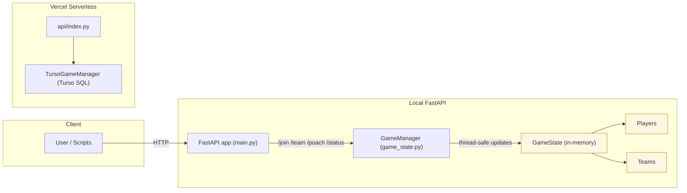
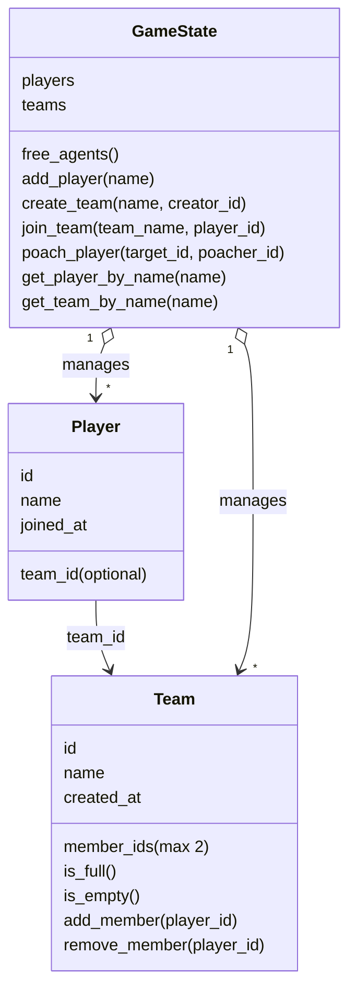
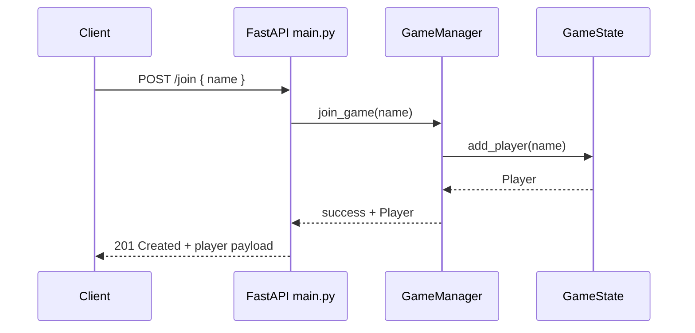
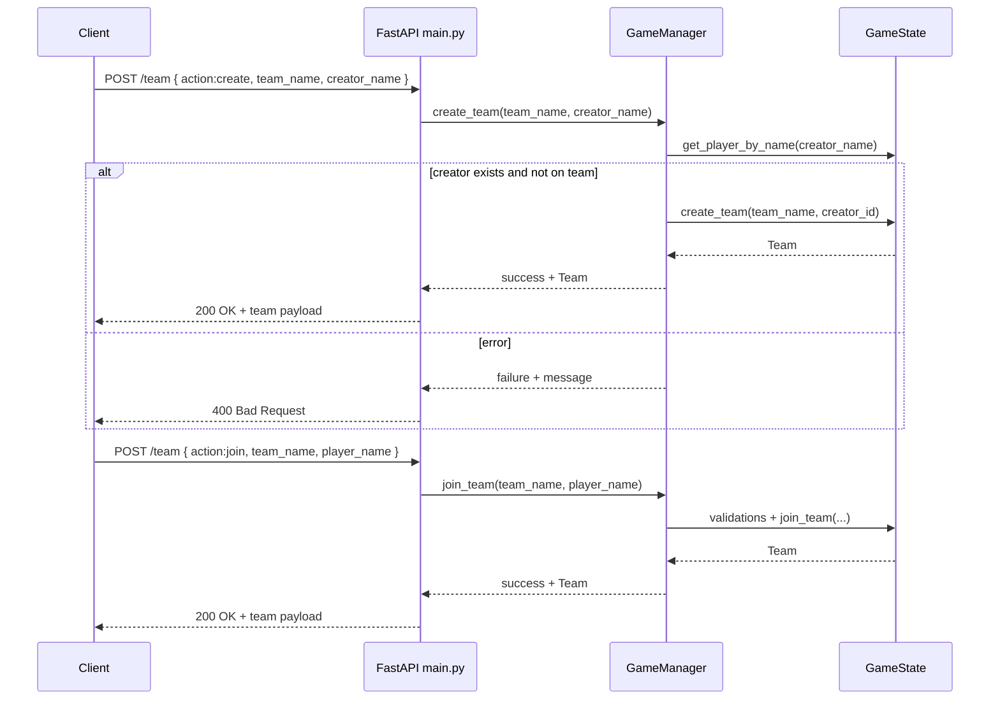
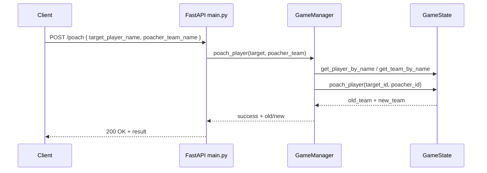
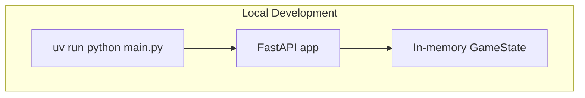
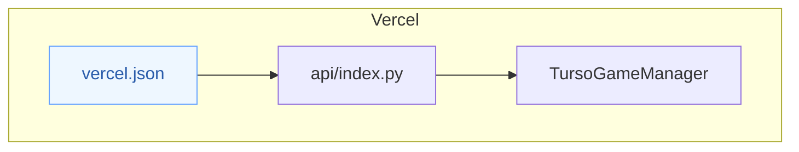

# Mermaid Diagrams

## Architecture Overview

```mermaid
flowchart LR
    subgraph Client
        U[User / Scripts]
    end

    subgraph Local FastAPI
        APP["FastAPI app (main.py)"]
        GM["GameManager (game_state.py)"]
        GS["GameState (in-memory)"]
        APP -->|/join /team /poach /status| GM
        GM -->|thread-safe updates| GS
        GS --> P["Players"]
        GS --> T["Teams"]
    end

    U -->|HTTP| APP

    subgraph Vercel Serverless
        VAPP["api/index.py"]
        TGM["TursoGameManager (Turso SQL)"]
        VAPP --> TGM
    end

    classDef store fill:#fdf6e3,stroke:#b58900,color:#333
    classDef svc fill:#eef,stroke:#88a,color:#333
    class APP,WAPP,VAPP svc
    class GS,P,T store
```

## Data Model

```mermaid
classDiagram
    class Player {
      id
      name
      team_id (optional)
      joined_at
    }

    class Team {
      id
      name
      member_ids (max 2)
      created_at
      is_full()
      is_empty()
      add_member(player_id)
      remove_member(player_id)
    }

    class GameState {
      players
      teams
      free_agents()
      add_player(name)
      create_team(name, creator_id)
      join_team(team_name, player_id)
      poach_player(target_id, poacher_id)
      get_player_by_name(name)
      get_team_by_name(name)
    }

    Player --> Team : team_id
    GameState "1" o--> "*" Player : manages
    GameState "1" o--> "*" Team : manages
```

## Sequence: Join Game

```mermaid
sequenceDiagram
    participant C as Client
    participant API as FastAPI main.py
    participant GM as GameManager
    participant GS as GameState

    C->>API: POST /join { name }
    API->>GM: join_game(name)
    GM->>GS: add_player(name)
    GS-->>GM: Player
    GM-->>API: success + Player
    API-->>C: 201 Created + player payload
```

## Sequence: Create/Join Team

```mermaid
sequenceDiagram
    participant C as Client
    participant API as FastAPI main.py
    participant GM as GameManager
    participant GS as GameState

    C->>API: POST /team { action:create, team_name, creator_name }
    API->>GM: create_team(team_name, creator_name)
    GM->>GS: get_player_by_name(creator_name)
    alt creator exists and not on team
        GM->>GS: create_team(team_name, creator_id)
        GS-->>GM: Team
        GM-->>API: success + Team
        API-->>C: 200 OK + team payload
    else error
        GM-->>API: failure + message
        API-->>C: 400 Bad Request
    end

    C->>API: POST /team { action:join, team_name, player_name }
    API->>GM: join_team(team_name, player_name)
    GM->>GS: validations + join_team(...)
    GS-->>GM: Team
    GM-->>API: success + Team
    API-->>C: 200 OK + team payload
```

## Sequence: Poach Player

```mermaid
sequenceDiagram
    participant C as Client
    participant API as FastAPI main.py
    participant GM as GameManager
    participant GS as GameState

    C->>API: POST /poach { target_player_name, poacher_team_name }
    API->>GM: poach_player(target, poacher_team)
    GM->>GS: get_player_by_name / get_team_by_name
    GM->>GS: poach_player(target_id, poacher_id)
    GS-->>GM: old_team + new_team
    GM-->>API: success + old/new
    API-->>C: 200 OK + result
```

## Deployment Paths

```mermaid
flowchart TB
    subgraph Local Development
        A["uv run python main.py"] --> FAPI["FastAPI app"]
        FAPI --> InMem["In-memory GameState"]
    end
    classDef cfg fill:#eef7ff,stroke:#66a3ff,color:#2b5dab
```

```mermaid
flowchart TB
    subgraph Vercel
        C["api/index.py"] --> TGM["TursoGameManager"]
        vercel["vercel.json"]:::cfg --> C
    end

    classDef cfg fill:#eef7ff,stroke:#66a3ff,color:#2b5dab
```
